# Flexbox Layout Module

September 2020

\> 🔨 Flexbox. From Udemy '[Flexbox CSS - Le guide complet par la pratique](https://www.udemy.com/course/guide-complet-flexbox/)'

\* * *


- [Flexbox Layout Module](#flexbox-layout-module)
  * [Flex](#flex)
  * [Terminology](#terminology)
  * [Container](#container)
    + [Prefixes](#prefixes)
    + [flex-direction](#flex-direction)
    + [display: flex / display: inline-flex](#display--flex---display--inline-flex)
    + [justify-content](#justify-content)
    + [flex-wrap](#flex-wrap)
    + [align-items](#align-items)
    + [flex-flow](#flex-flow)
  * [Items](#items)
    + [order](#order)
    + [flex-grow](#flex-grow)
    + [flex-basis](#flex-basis)
    + [flex-shrink](#flex-shrink)
    + [flex](#flex)
    + [align-self](#align-self)
  * [Center elements](#center-elements)
  * [Media queries](#media-queries)
  * [Exercices](#exercices)
    + [How to test](#how-to-test)
    + [Results](#results)
      - [Web](#web)
      - [Tablet](#tablet)
      - [Phone](#phone)
  * [Useful links](#useful-links)

<small><i><a href='http://ecotrust-canada.github.io/markdown-toc/'>Table of contents generated with markdown-toc</a></i></small>


## Flex

Before we used that kind of solutions to display elements:


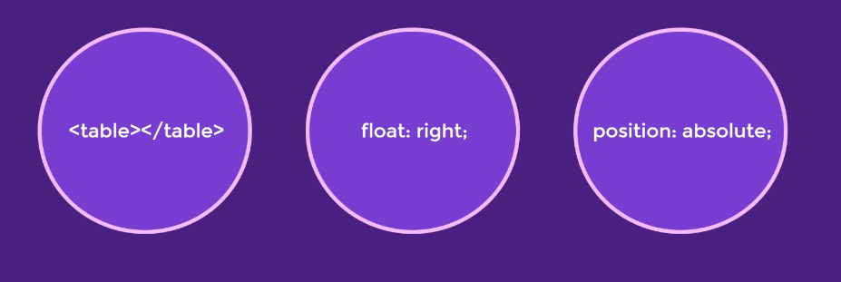


Or usual boxes models: display; inline, inline-block

New model: `display: flex`. It's an easy way to divide and position children elements. It's possible to modify order: asc, desc etc...

## Terminology

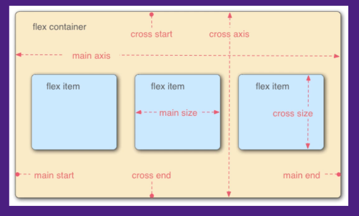


## Container

Flex is a container that content children called items.

Container ('flex container') = Parent

Items ('flex items') = Children

````scss
.container{
  display: flex;
}
````

````html
<div class="container">
  <div class="item">1</div>
  <div class="item">2</div>
  <div class="item">3</div>
  <div class="item">4</div>
</div>
````


### Prefixes

If you don't use css postprocessor, you maybe will have to add prefixes with some browsers

````CSS
.container{
    display: -webkit-box;
    display: -moz-box;
    display: -ms-flexbox;
    display: -webkit-flex;
    display: flex;
}
````

### flex-direction

 `display: flex` main declaration.

`flex-direction` defines **main axi**s and **distribution wa**y, default is `flex-direction: row` (default left to right).

````scss
.container{
  display: flex;
  flex-direction: row;
}
````

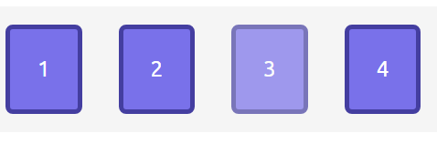

`flex-direction: row-reverse`, will change the distribution way.

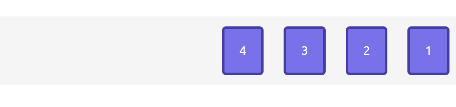

`flex-direction: column`, to change main axis to vertical axis. We can invert the way of distribution from bottom to top, using `flex-direction: column-reverse`

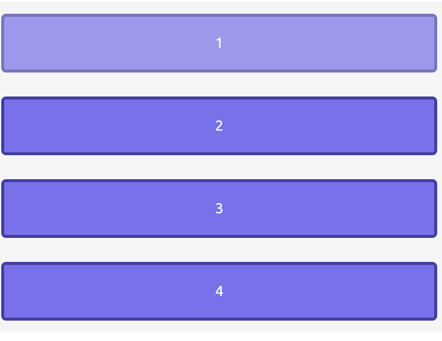

### display: flex / display: inline-flex

`display: flex;` by default same charcteriscics than display bloc: the container will take 100% of the width.

`display: inline-flex;` the container will stop after the last element. So it's possible to put elements after that bloc.

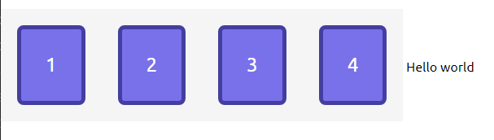

Its also possible to reproduce that behavior using a second container:

````scss
.box{
  display: flex;
}

.container{
  display: flex;
}
````

````html
<div class="box">
  <div class="container">
    <div class="item">1</div>
    <div class="item">2</div>
    <div class="item">3</div>
    <div class="item">4</div>
  </div>
  <span>Hello world</span>
</div>
````

### justify-content

Is linked to main axis `flex-direction`. The behavior will change if we change it.

`justify-content: flex-start;` **default**: first element will stick to the begining of the way of distribution.

`justify-content: flex-end;` last element will stick on the end the way of distribution..

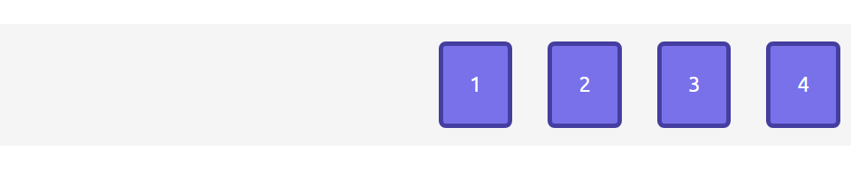

`justify-content: center;` center the block.

`justify-content: space-around`element will divide along the container. It will add a 'one unit' space on left and right and '2 units' between items..

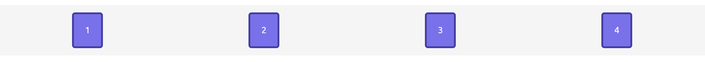

`justify-content: space-evenly`: keep the same space before, after and between elements.

`justify-content: space-between`: keep the same space  between elements, but the first and last elements will be stick on left and right.

Warning, the important point is the way of distribution.  Don't think about left; right, bottom, top concepts., but in terms of 'flex-direction'.

For instance, if we these settings:

````scss
.container{
  display: flex;
  flex-direction: row-reverse;
  justify-content: flex-end;
}
````

Flex-end is not on the right but on the left.

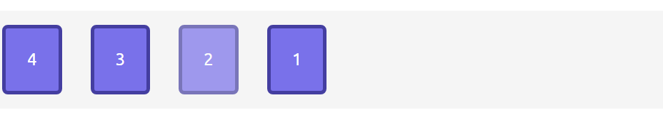

### flex-wrap

`flex-wrap: nowrap`: **default** elements are put insie and outside the container with a scrollbar...

If we want to 'cut' the distribution axis, we use `flex-wrap: wrap`;

````scss
.container{
  display: flex;
  flex-direction: row-reverse;
  flex-wrap: wrap;
}
````

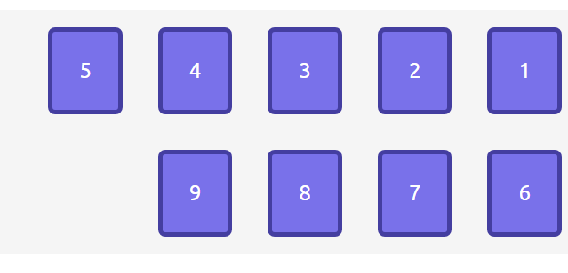

`flex-wrap: wrap-reverse`: the last line will be displayed in first position.

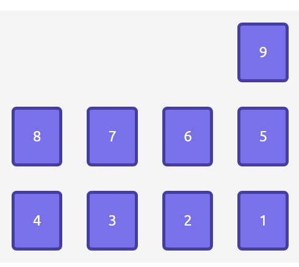

### align-items

**Secondary** axis: oppositeaxis to main axis.

`flex-direction: column`: secondary axis is row / horizontal.

`flex-direction: row`: secondary axis is column / vertical.

`align-item`s manages alignement on secondary axis.

Properties:

`align-items: flex-start` : stick the elements on the beginning of the distribution on the secondary axis.

`align-items: flex-center` : center elements.

`align-items: baseline` : align on base line (bottom of the content)

`align-item: stretch` :  stretch to fill the container verticaly

### flex-flow

Combine `flex-direction` and `flex-wrap` (shortcut).

ex:

````scss
flex-direction: column;
flex-wrap: wrap;
````

becomes:

`flex-flow: column wrap `

## Items

### order

By default: 0. Means 'html' order.

To choose the order to display items  (integer).

````scss
.container{
  display: flex;
}

.item:nth-child(1){
  order: 1;
}
````

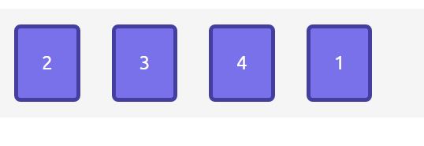

### flex-grow

Allows to share the space used by items proportionately on main axis.

Value are integers.

````scss
.container{
  display: flex;
}

.item:nth-child(1){
  flex-grow: 1;
}

.item:nth-child(2){
  flex-grow: 2;
}
````

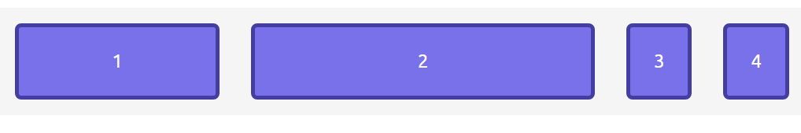

### flex-basis

It specifies the initial size of the flex item, before **any available space is distributed according to the flex factors**. When omitted from the flex shorthand, its specified value is the length zero. it takes same values than dimensions (ex: width).

**Hierarchy:**

min-width & max-width => flex-basis => width => content (inside box)

**Use of leaving space:**

Exemple a container of 800px. Items have 100px, but the first one has 200px as flex-basis.

So we still have 500px. If we put the following values as flex-grow:


````scss
.container{
  display: flex;
}

.item{
  width: 100px;
}

.item:nth-child(1){
  flex-basis: 200px;
  flex-grow: 2;
}

.item:nth-child(2){
  flex-grow: 1;
}
````

It means that the first element will take 200px + 2/3 of leaving space (500); so 333,33px.

The second element will take 100px +1/3 of leaving space (500);, so 166,66.

533.33 px + 266.66 px = 800px.

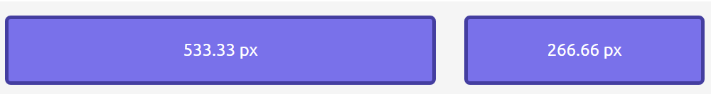

If we add padding etc, it will leave less space after items.  So it will impact the calculation of flex-grow.

### flex-shrink

It specifies the “flex shrink factor”, which determines how much the flex item will shrink relative to the rest of the flex items in the flex container when **there isn’t enough space on the row**.

Value by default: 1.

0 is the original size of the elements.

**Use of negative space available:**

Exemple if we have **3 items** of 400px + 20px as border for the container.

There are bigger than our container of 800px, because there are 'too many content to put in a little box'...

Total space needed is 1220px and we have 800px asd container, so 420px are missing (negative space), 140px by element.

So it means that each element should make 400-140= 260px

````scss
.container{
  width: 800px;
  display: flex;
  border: 10px solid red;
}

.item{
  flex-basis: 400px;
  flex-shrink: 1;
}
````


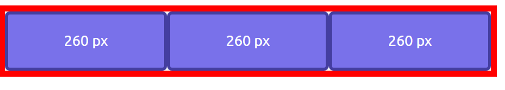

With a different flex-shrink:

420px are missing (negative space).

There are '4 shrinks' as total.

````scss
.container{
  width: 800px;
  margin: 0px;
  padding: 0px;
  display: flex;
  border: 10px solid red;
}

.item{
  flex-basis: 400px;
  flex-shrink: 1;
}

.item:nth-child(1){
  flex-shrink: 2;
}
````

Item 1: 420 * 2/4 = 210 px (negative space available).

Space needed for item 1: 400 - 210 = 190 px.


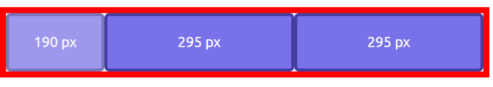

### flex

flex-grow / flex-shrink / flex-basis

Default value: flex: 0 1 auto.

````scss
.container{
  display: flex;
}

.item{
  flex: 0 1 20%;
}
````

Is:

````scss
.container{
  display: flex;
}

.item{
  flex-grow: 0;
  flex-shrink: 1;
  flex-basis: 20%;
}
````

### align-self

Align an item in particular on secondary axis. Have the same values than align-items.

align-self > align-items.

## Center elements


````scss
.container{
  display: flex;
  height: 500px;
  align-items: center;
  justify-content: center;
}
````

Or:

````scss
//not really aligned if there are several items because it add 2 margins between them

.container{
  display: flex;
  height: 500px;
}

.item{
  margin: auto;
}
````


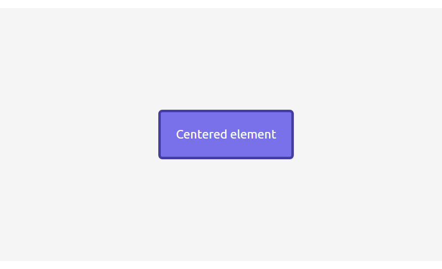

## Media queries

Exemple of use:

````html
<span id="computer">Computer</span>
<span id="tablet">Tablet</span>
<span id="phone">Phone</span>
````

````scss
#tablet {
  display: none;
}

#phone {
  display: none;
}

@media screen and (max-width: 700px){
  #computer{
    display: none;
  }
  #tablet{
    display: block;
  }
}

@media screen and (max-width: 400px){
  #tablet{
    display: none;
  }
  #phone{
    display: block;
  }
}
````

## Exercices

- Responsive menu
- Pagination
- Layout
- Sticky footer
- Responsive grid

### How to test

- Clone
- `npm install`
- `parcel serve index.html`
- Launch: `http://localhost:1234`

### Results

#### Web

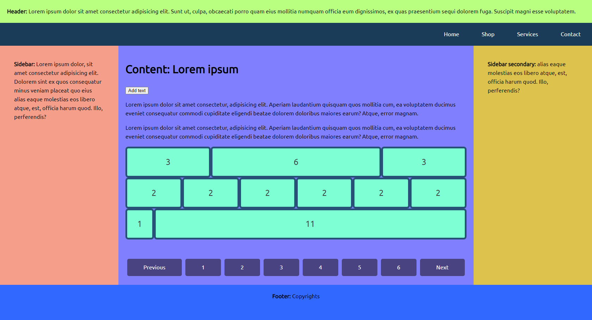

#### Tablet

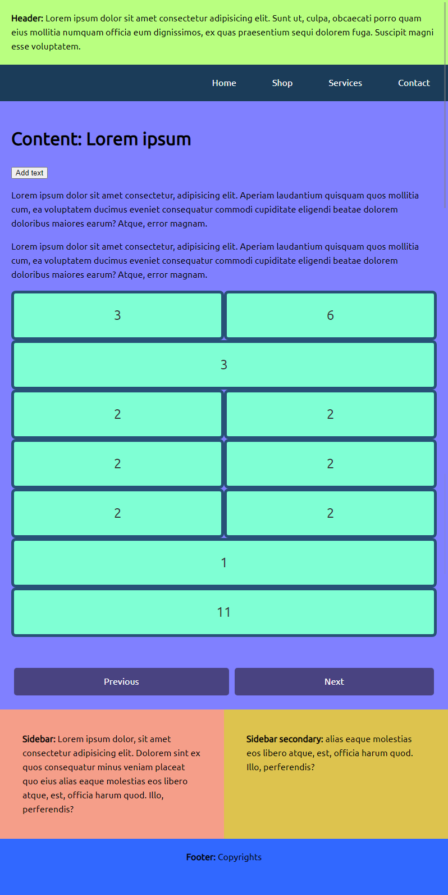

#### Phone

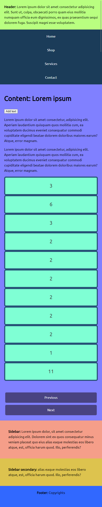

## Useful links

- [A Complete Guide to Flexbox](https://css-tricks.com/snippets/css/a-guide-to-flexbox/)
- [Sticky Footer, Five Ways](https://css-tricks.com/couple-takes-sticky-footer/)
- [Flexbox Grid](http://flexboxgrid.com/)