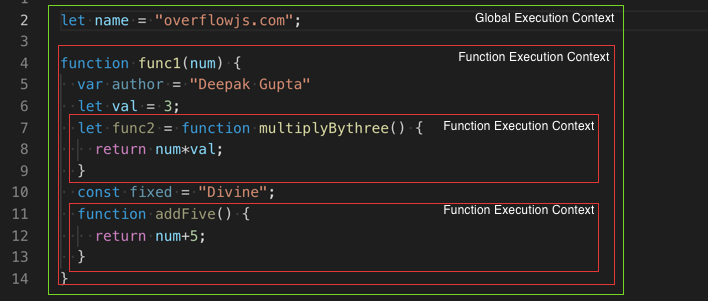
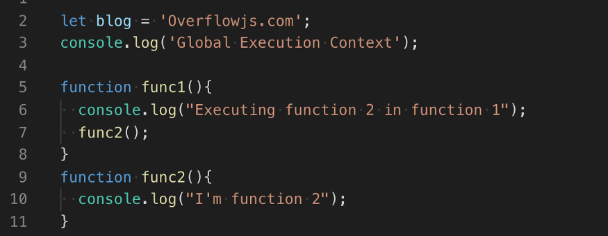
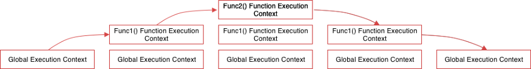

# Javascript: Table of content

- [Javascript: overview](#javascript--overview)
  * [JavaScript Programming Paradigms](#javascript-programming-paradigms)
    + [Procedural programming](#procedural-programming)
    + [Functional programming](#functional-programming)
    + [Prototype-based / object-oriented programming](#prototype-based---object-oriented-programming)
  * [Data types](#data-types)
  * [Scope](#scope)
  * [Context / .this](#context---this)
  * [Stack data structure](#stack-data-structure)
  * [Execution Context](#execution-context)
    + [Global Execution Context](#global-execution-context)
    + [Function Execution Context](#function-execution-context)
  * [Execution Stack / Call Stack](#execution-stack---call-stack)
  * [Execution Context Phases](#execution-context-phases)
    + [Creation phase](#creation-phase)
    + [Execution Phase / hoisting](#execution-phase---hoisting)
  * [Useful links / Sources](#useful-links---sources)
- [Javascript: concepts](#javascript--concepts)
  * [Classes](#classes)
    + [Constructors and methods](#constructors-and-methods)
    + [Inheritance](#inheritance)
    + [Accessors: Getters / Setters](#accessors--getters---setters)
  * [Factory function pattern](#factory-function-pattern)
  * [(Fat) Arrow Functions](#-fat--arrow-functions)
  * [Higher-order functions](#higher-order-functions)
  * [Callback](#callback)
  * [Recursive functions](#recursive-functions)
  * [Asynchronous functions](#asynchronous-functions)
    + [Callback](#callback-1)
    + [Promises](#promises)
    + [Async / Await](#async---await)
  * [Ternary Operator](#ternary-operator)
  * [Property accessors](#property-accessors)
  * [Destructuring](#destructuring)
  * [Useful links / Sources](#useful-links---sources-1)

<small><i><a href='http://ecotrust-canada.github.io/markdown-toc/'>Table of contents generated with markdown-toc</a></i></small>


# Javascript: overview

**JavaScript®** (often shortened to JS) is a lightweight, interpreted, object-oriented language with first-class functions, and is best known as the scripting language for Web pages, but it's used in many non-browser environments as well. It is a prototype-based, multi-paradigm scripting language that is dynamic, and supports object-oriented, imperative, and functional programming styles.

JavaScript runs on the client side of the web, which can be used to design / program how the web pages behave on the occurrence of an event. JavaScript is an easy to learn and also powerful scripting language, widely used for controlling web page behavior.

## JavaScript Programming Paradigms

### Procedural programming

Procedural programming is all about writing “procedures”. You could kind of translate this with: “Write down the steps your program should execute in order”.

### Functional programming

Functional programming is a paradigm of building computer programs using expressions and functions without mutating state and data.

1. Don’t mutate data
2. Use pure functions: fixed output for fixed inputs, and no side effects
3. Use expressions and declarations

### Prototype-based / object-oriented programming

JavaScript isn't a classed-based langauge – it's is a prototype-based language.

Prototype-based programming is a style of object-oriented programming in which classes are not explicitly defined, but rather derived by adding properties and methods to an instance of another class or, less frequently, adding them to an empty object.

In simple words: this type of style allows the creation of an object without first defining its class.

JavaScript introduced the class keyword in ECMAScript 2015 (ECMAScript 6). It makes JavaScript seem like an OOP language. But it is just syntaxic sugar over the existing prototyping technique. It continues its prototyping in the background but makes the outer body look like OOP. 

See infra in 'Concepts' to know how to manage classes in JS.

## Data types

Data types basically specify what kind of data can be stored and manipulated within a program.

In JS, there are primitive data types and reference data types. primitive data types are referenced by value while the non-primitive/reference data types point to memory addresses.

Primitive data types are:

- Boolean
- Number
- String
- Null
- Undefined
- Symbol

Reference data types are:

- Objects
- Arrays

## Scope

The scope is a policy that manages the availability of **variables**. A variable defined inside a scope is accessible only within that scope, but inaccessible outside.

In JavaScript, scopes are created by code blocks (between {}: loops, conditionals...), functions, modules.

While `const` and `let` variables are scoped by code blocks, functions or modules (*block scoped*, ...), `var` variables are scoped only by functions or modules (*function scoped*).

Scopes can be nested. Inside an inner scope you can access the variables of an outer scope.

Since ES6, we only use `const` and `let` .

## Context / .this

Context is related to objects. It refers to the object to which a function belongs. When you use the JavaScript “this” keyword, it refers to the object to which function belongs.

Every function invocation has both a scope and a context associated with it. Fundamentally, scope is function-based while context is object-based. In other words, scope pertains to the variable access of a function when it is invoked and is unique to each invocation. Context is always the value of the this keyword which is a reference to the object that “owns” the currently executing code.

## Stack data structure

A stack is a data structure that holds a list of elements. A stack works based on the LIFO principle i.e., Last In, First out, meaning that the most recently added element is the first one to remove.

A stack has two main operations that occur only at the top of the stack: push and pop. The push operation places an element at the top of stack whereas the pop operation removes an element from the top of the stack.

## Execution Context

An environment in which the javascript code runs is what form an execution context.

The execution context decides what particular piece of code has access to variables, functions, objects, etc.

### Global Execution Context

Whenever the code runs for the first time or when the code is not inside any function then it gets into the global execution context.  There is only one global execution context throughout the execution of code.
In the case of browser global execution context does 2 things:

- Create a ‘window’ object.
- The window object is referenced to ‘this’ keyword.

### Function Execution Context

Whenever the code execution found a function it creates a new function execution contexts. There can be any number of function execution contexts.





Above, Global execution context contains ‘name’ variable and a function reference to ‘func1’. Whereas three function execution context containing variables and function reference will be created. 

## Execution Stack / Call Stack

Javascript can only run one thing at one time in the browser that means it is the single thread so it queues the other action, events, function in what is called as the execution stack.

Whenever a script load in the browser, the first element in the stack is the global execution context. However, when a function executes, an execution context is created and virtually placed on top of the global execution context. Once a function has finished executing, it gets popped off of the execution stack and returning control to the context below it.





## Execution Context Phases

There are mainly two phases of the execution context.

1. Creation
2. Execution

### Creation phase

There are several things that happen here before the function execution happen.

1. At first, a connection to the outer environment is created for each function or variables which is what form a scope chain. This tells the execution context what should it contain and where should it look for resolving the reference for function and values for variables.
   - For the global environment, the outer environment is null. However, all environments within the global, have the global environment as its outer environment.
   - If function ‘a’, contained in function ‘b’, that means ‘a’ has an outer environment ‘b’.

2. After scanning the scope chain an environment record is created where the creation and reference for global context(would be a window in a web browser), variable, function, and function arguments are done in memory.
3. At last value of ‘this’ keyword is determined (In the case of the global execution context, ‘this’ refers to the window) inside each execution context created in the 1st step.

````javascript
creationPhase = {
'outerEnvironmentConnection': {
        /* scope chain resolution*/ 
    },    
'variableObjectMapping': {
        /* function arguments, parameters, inner variable and function declarations are created or referenced in memory */ 
    },
    'valueOfThis': {},    
}
````

### Execution Phase / hoisting

This is the phase where the code starts to run in the execution context formed in the creation phase and variable values are assigned line by line.

As the execution start, the engine looks for reference to execute the function in its creation phase object. If it doesn’t find it in its own, it will continue to move up the scope chain until it reaches the global environment.

If no references are found in the global environment it will return an error. However, if a reference is found and the function is executed correctly, the execution context of this particular function will be popped off the stack and the engine will move onto the next function, where their execution context will be added to the stack and executed, and so on.

In JavaScript, variable and function declarations are stored into memory during the compile phase before any code is actually executed. This is referred to as hoisting because it seems like the variables and function delarations are magically “hoisted” to the top of the scope. So for instance if you call a function then you declare it (not a good practice), it will work because javascript will 'move' the function before its calling.

After the function completes its execution, the global environment is updated. Then the global code completes and the program finishes.

An important difference between **function declarations** and **class declarations** is that function declarations are hoisted and **class declarations are not**. You first need to declare your class and then access it, otherwise code like the following will throw a `ReferenceError`.

## Useful links / Sources

- [Introduction to Functional Programming: JavaScript Paradigms](https://www.toptal.com/javascript/functional-programming-javascript)
- [Object Oriented Programming in JavaScript – Explained with Examples](https://www.freecodecamp.org/news/how-javascript-implements-oop/)
- [JavaScript Scope Explained in Simple Words](https://dmitripavlutin.com/javascript-scope/)
- [Implementing Javascript Stack Using an Array](https://www.javascripttutorial.net/javascript-stack/)

- [Javascript Execution Context and Hoisting](https://towardsdatascience.com/javascript-execution-context-and-hoisting-c2cc4993e37d)

- [Scope and Hoisting: var, let, and const](https://codehannah.nyc/posts/scope_and_hoisting/)

- [Javascript | Les Fonctions, Portée et Hoisting](https://www.youtube.com/watch?v=dqnXG0Ik6Ls)

- [Understanding JavaScript Execution Context like never before](https://blog.greenroots.info/understanding-javascript-execution-context-like-never-before-ckb8x246k00f56hs1nefzpysq)


# Javascript: concepts

## Classes

There are three concepts in Object-Oriented Programming: **Object**, **Class** and **Methods**. The ES6 JavaScript supports the Object-Oriented programming components.

- **Object:** A real-time object entity means the presentation of any entity in real-time.
- **Class:** It is the before the plan of creating any objects which are known as blueprint of any objects which you want to create.
- **Methods:** It communicates between the objects.

### Constructors and methods

The class contains the **Constructors** and **Functions**. The Constructors take responsibility for allocating memory for the objects of the class. The function takes the responsibility of the action of the objects. Combing these two **Constructor** and **Function** to make the **Class**.

In the ES6 to create any class, you need to use the **class** keyword.

````javascript
class Cat {
    //Public field declarations
    foo = 0;
  	bar;
	//Constructor
    constructor(race,color,age){
        this.race = race;
        this.color = color;
        this.age = age;
    }
	//Method
    petting(){
        console.log(`You pet your ${this.race}`); 
    }
}

const cat = new Cat("Siamese", "Gray", 8);
// console.log(cat.petting());

const cat = cat.petting.bind(cat);//we need to bind.this

console.log(cat2());
````

A **class expression** is another way to define a class. Class expressions can be named or unnamed. The name given to a named class expression is local to the class's body. (it can be retrieved through the class's (not an instance's) `name` property, though).

```js
// unnamed
let Rectangle = class {
  constructor(height, width) {
    this.height = height;
    this.width = width;
  }
};
console.log(Rectangle.name);
// output: "Rectangle"

// named
let Rectangle = class Rectangle2 {
  constructor(height, width) {
    this.height = height;
    this.width = width;
  }
};
console.log(Rectangle.name);
// output: "Rectangle2"
```

We can use the `static` keyword defines a static method for a class. **Static methods** are called without instantiating their class and cannot be called through a class instance. Static methods are often used to create utility functions for an application.

```javascript
class Foo(){
   static methodName(){
      console.log("bar")
   }
}
```
### Inheritance

Class inheritance is a way for one class to extend another class.

So we can create new functionality on top of the existing.

Exemple with overiding the method using `super.method(...)` to call a parent method.

````javascript
class Animal {

  constructor(name) {
    this.speed = 0;
    this.name = name;
  }

  run(speed) {
    this.speed = speed;
    alert(`${this.name} runs with speed ${this.speed}.`);
  }

  stop() {
    this.speed = 0;
    alert(`${this.name} stands still.`);
  }

}

class Rabbit extends Animal {
  hide() {
    alert(`${this.name} hides!`);
  }

  stop() {
    super.stop(); // call parent stop
    this.hide(); // and then hide
  }
}

let rabbit = new Rabbit("White Rabbit");

rabbit.run(5); // White Rabbit runs with speed 5.
rabbit.stop(); // White Rabbit stands still. White rabbit hides!
````

Exemple with overiding the constructor using `super(...)` to call a parent constructor (inside our constructor only).

````javascript
class Animal {

  constructor(name) {
    this.speed = 0;
    this.name = name;
  }

  // ...
}

class Rabbit extends Animal {

  constructor(name, earLength) {
    super(name);
    this.earLength = earLength;
  }

  // ...
}

let rabbit = new Rabbit("White Rabbit", 10);
alert(rabbit.name); // White Rabbit
alert(rabbit.earLength); // 10
````

The extends keyword still uses prototype-based inheritance under the hood. That means you can use prototype-based patterns in combination with ES6 classes.

```javascript
class Animal {

  constructor(name) {
    this.name = name;
  }

  // ...
}

Animal.prototype.hide = function hide() {
  return alert(`${this.name} hides!`);
};

let rabbit = new Rabbit("White Rabbit");

rabbit.hide(); // White rabbit hides!
```

### Accessors: Getters / Setters

Get and set allows us to run code on the reading or writing of a property. 

The **`get`** syntax binds an object property to a function that will be called when that property is looked up.

The **`set`** syntax binds an object property to a function to be called when there is an attempt to set that property.

```javascript
// ES6 get and set
class Person {
  constructor(name) {
    this._name = name;
  }

  get name() {
    return this._name.toUpperCase();
  }

  set name(newName) {
    this._name = newName; // validation could be checked here such as only allowing non numerical values
  }

  walk() {
    console.log(this._name + ' is walking.');
  }
}

let bob = new Person('Bob');
console.log(bob.name); // Outputs 'BOB'
```

## Factory function pattern

The factory function pattern is similar to constructors, but instead of using `new` to create an object, factory functions simply set up and return the new object when you call the function. A factory function is called like a "regular" function.

We don't need to use `this` or `bind.this`.

Previous exemple without construcor but using a factory function:

````javascript
function createACat(race,color,age) {

    function petting(){
        console.log(`You pet your ${race}`);// `es6 backtick to use var in strings`
    }

    return {
       race, //race: race,
       color,
       age,
       calin
    }
}

const cat1 = createACat('Siamese', 'Gray', 6)

const methodeReassigne = cat1.petting;

console.log(methodeReassigne());
````

## (Fat) Arrow Functions

Arrow functions – also called “fat arrow” functions are a more concise syntax for writing function expressions. They utilize a new token, `=>`, that looks like a fat arrow. Arrow functions are **anonymous** and change the way `this` binds in functions.

We don't need to use `bind` to create a new function that will force the this inside the function to be the parameter passed to `bind()`.

Arrow functions make our code more concise, and simplify function scoping and the `this` keyword. By using arrow functions, we avoid having to type the `function` keyword, `return` keyword (it’s implicit in arrow functions), and curly brackets.

```javascript
// ES5
var multiplyES5 = function(x, y) {
  return x * y;
};

// ES6
const multiplyES6 = (x, y) => { return x * y };
```

## Higher-order functions

A Higher-Order function is a function that receives a function as an input argument or returns a function as output. This is a concept that was born out of functional programming. 

JavaScript comes with some built-in higher-order functions:

The `map()` method creates a new array with the results of calling a provided function on every element in the calling array. What this means is map() calls a provided callback function once for each element in an array, in order, and constructs a new array from the results.

The `filter()` method creates a new array with all the elements that pass the test provided by a callback function. It also takes in a function as an argument.

Another built-in higher-order function in JavaScript is the `reduce()` method. It executes the callback function on each member of the calling array, and results in a single output value.

## Callback

In JavaScript, functions are objects. Because of this, functions can take functions as arguments, and can be returned by other functions. Functions that do this are called higher-order functions. Any function that is passed as an argument is called a callback function.

So a callback is a function that is to be executed after another function has finished executing — hence the name ‘call back’.

```js
function salutation(name) {
  alert('Bonjour ' + name);
}

function processUserInput(callback) {
  var name = prompt('Entrez votre nom.');
  callback(name);
}

processUserInput(salutation);
```

## Recursive functions

 A recursive function is **a function which calls itself.** 

As an example, let’s look at using a recursive function used to calculate the factorial of a number, n. (A factorial being the product of a positive integer with all of the whole numbers lower than it; e.g: 4! = 4x3x2x1 = 24).

````javascript
const factorial =(n) => {
return (n !== 1) ? n * factorial(n-1) : 1;
}

````

## Asynchronous functions

**Synchronous** operations in JavaScript entails having each step of an operation waits for the previous step to execute completely. This means no matter how long a previous process takes, subsquent process won't kick off until the former is completed. 

**Asynchronous** operations, on the other hand, defers operations. Any process that takes a lot of time to process is usually run alongside other synchronous operation and completes in the future.

### Callback

Callback functions have been used alone for asynchronous operations in JavaScript for many years but if there are multiple async operations to be done and if we try to use Callbacks for them, we’ll find ourselves quickly inside a situation called 'Callback hell' (the code is hard to get right intuitively).

```javascript
firstRequest(function(response) {  
    secondRequest(response, function(nextResponse) {    
        thirdRequest(nextResponse, function(finalResponse) {     
            console.log('Final response: ' + finalResponse);    
        }, failureCallback);  
    }, failureCallback);
}, failureCallback);
```

### Promises

A promise is used to handle the asynchronous result of an operation. JavaScript is designed to not wait for an asynchrnous block of code to completely execute before other synchronous parts of the code can run. For instance, when making API requests to servers, we have no idea if these servers are offline or online, or how long it takes to process the server request.

With Promises, we can defer execution of a code block until an async request is completed. This way, other operations can keep running without interruption.

Promises have three states:

- **Pending**: This is the initial state of the Promise before an operation begins
- **Fulfilled**: This means the specified operation was completed
- **Rejected**: The operation did not complete; an error value is usually thrown

```javascript
firstRequest()
   //then( ) for resolved Promises:
  .then(function(response) {
    return secondRequest(response);
}).then(function(nextResponse) {  
    return thirdRequest(nextResponse);
}).then(function(finalResponse) {  
    console.log('Final response: ' + finalResponse);
}).catch(failureCallback);//catch( ) for rejected Promises
```

### Async / Await

**Async** functions enable us to write promise based code as if it were synchronous, but without blocking the execution thread. It operates asynchronously via the event-loop. Async functions will always return a value. Using `async` simply implies that a promise will be returned, and if a `promise `is not returned, JavaScript automatically wraps it in a resolved `promise` with its value.

The **await** operator is used to wait for a Promise. It can be used inside an Async block only. The keyword Await makes JavaScript wait until the promise returns a result. It has to be noted that it only makes the `async` function block wait and not the whole program execution.

```javascript
async function firstAsync() {
    let promise = new Promise((res, rej) => {
        setTimeout(() => res("Now it's done!"), 1000)
    });

    // wait until the promise returns us a value
    let result = await promise; 
  
    // "Now it's done!"
    alert(result); 
    }
};firstAsync();
```

## Ternary Operator 

The conditional ternary operator in JavaScript assigns a value to a variable based on some condition and is the only JavaScript operator that takes three operands.

`<condition> ? <expression> : <expression>`

The ternary operator is a substitute for an if statement in which both the if and else clauses assign different values to the same field, like so:

```javascript
if (condition)
result = 'something';
else
result = 'som'
```

The ternary operator shortens this if/else statement into a single statement:

```javascript
result = (condition) ? 'something' : 'som'
```

If *condition* is true, the ternary operator returns the value of the first expression; otherwise, it returns the value of the second expression. 

## Property accessors

Property accessors provide access to an object's properties by using the dot notation or the bracket notation.

In the `object.property` syntax, the `property` must be a valid JavaScript identifier.

An identifier is a sequence of characters in the code that identifies a variable, function, or property.

In JavaScript, identifiers are case-sensitive and can contain Unicode letters, `$`, `_`, and digits (0-9), but may not start with a digit.

````javascript
const person1 = {};
person1['firstname'] = 'Mario';
person1['lastname'] = 'Rossi';

console.log(person1.firstname);
// expected output: "Mario"

const person2 = {
  firstname: 'John',
  lastname: 'Doe'
};

console.log(person2['lastname']);
// expected output: "Doe"

````

## Destructuring

Destructuring simply implies breaking down a complex structure into simpler parts. In JavaScript, this complex structure is usually an object or an array. 

With the destructuring syntax, you can extract smaller fragments from arrays and objects. Destructuring syntax can be used for variable declaration or variable assignment. You can also handle nested structures by using nested destructuring syntax.

````javascript
let myArray = [1, 2, 3];
let first = myArray[0];
let second = myArray[1];
let third = myArray[2];
````

Es6 destructuring:

````
let myArray = [1, 2, 3];
let [first, second, third] = myArray;
````

## Useful links / Sources

- [JavaScriptJavaScript ES6 Class Syntax](https://coryrylan.com/blog/javascript-es6-class-syntax)

- [ES6 | Classes](https://www.geeksforgeeks.org/es6-classes/)

- [JavaScript ES6 Class Syntax](https://coryrylan.com/blog/javascript-es6-class-syntax)

- [Classes in JavaScript](https://masteringjs.io/tutorials/fundamentals/class)

- [Class inheritance](https://javascript.info/class-inheritance)
- [Les "Factory Function" en JavaScript](https://www.youtube.com/watch?v=3HU5l3P6KDc)

- [Factory functions and the module pattern](https://www.theodinproject.com/courses/javascript/lessons/factory-functions-and-the-module-pattern)

- [ES6 Arrow Functions: Fat and Concise Syntax in JavaScript](https://www.sitepoint.com/es6-arrow-functions-new-fat-concise-syntax-javascript/)

- [JavaScript — Understand Arrow Function Syntax](https://codeburst.io/javascript-understand-arrow-function-syntax-ab4081bba85b)

- [What are Higher-Order Functions in JavaScript?](https://programmingwithmosh.com/javascript/what-are-higher-order-functions-in-javascript/)

- [Higher-order functions in Javascript](https://dev.to/damcosset/higher-order-functions-in-javascript-4j8b)

- [JavaScript reduce](http://zetcode.com/javascript/reduce/)

- [JavaScript: What the heck is a Callback?](https://codeburst.io/javascript-what-the-heck-is-a-callback-aba4da2deced)
- [Asynchronous JavaScript: From Callback Hell to Async and Await](https://www.toptal.com/javascript/asynchronous-javascript-async-await-tutorial)

- [Exploring Async/Await Functions in JavaScript](https://alligator.io/js/async-functions/)

- [Callbacks, Promises, and Async](https://scotch.io/courses/10-need-to-know-javascript-concepts/callbacks-promises-and-async)

- [Recursive Functions in JavaScript](https://medium.com/@rossmawd/recursive-functions-in-javascript-9ab0dd97e486)

- [JavaScript Promise Tutorial: Resolve, Reject, and Chaining in JS and ES6](https://www.freecodecamp.org/news/javascript-es6-promises-for-beginners-resolve-reject-and-chaining-explained/)

- [ES6 Destructuring: The Complete Guide](https://codeburst.io/es6-destructuring-the-complete-guide-7f842d08b98f)
- [Dependency Injection Container in JavaScript](https://jsmanifest.com/dependency-injection-container-in-javascript/)

- [JavaScript try…catch Statement](https://www.javascripttutorial.net/javascript-try-catch/)

- [JavaScript Polymorphism](https://medium.com/@viktor.kukurba/object-oriented-programming-in-javascript-3-polymorphism-fb564c9f1ce8)
- [Object-oriented programming in JavaScript #4. Encapsulation.](https://medium.com/@viktor.kukurba/object-oriented-programming-in-javascript-4-encapsulation-4f9165cd26f9)
- [Javascript — A prototype based language](https://medium.com/@theflyingmantis/javascript-a-prototype-based-language-7e814cc7ae0b)